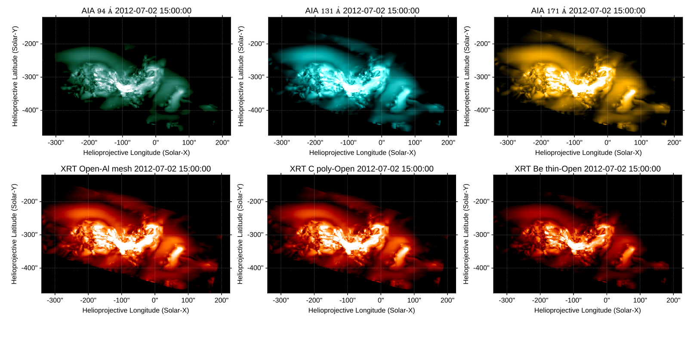

About Rushlight
===============

Rushlight relies on yt_ frontends to load simulation data from multiple numerical codes and calculate projections for arbitrary viewing perspectives.
Synthetic images are generated as Sunpy_ maps, and could be configured for model-to-data comparisons with event of interest by determining observation frame and from reference FITS file.

   Synthetic SDO/AIA and Hinode/XRT filter band images derived from a sample numerical dataset, based on the NLFFF extrapolation of AR11515.

.. admonition:: Summary
   :class: note

   Code could produce synthetic images from the results of MHD simulations.
   Resulting model-derived synthetic images can be used for model-to-data comparisons with the help of sunpy_ data analysis toolkit.

.. _sunpy: https://sunpy.org/
.. _CoronalLoopBuilder: https://github.com/sageyu123/CoronalLoopBuilder
.. _yt: https://yt-project.org/
