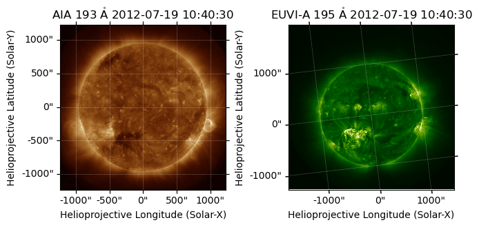
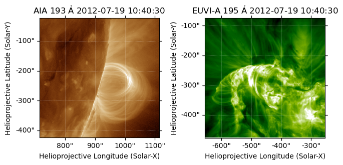

How to crop AIA and STEREO images for perspective comparison
============================================================

How to set up the cropping parameters and display settings for comparing
the two perspectives for a solar event. If you need to first collect a
pair of AIA / STEREO images, please see
`eg_aia_stereo_fetch.ipynb <eg_aia_stereo_fetch.ipynb>`__.

First import the necessary packages.

.. code:: ipython3

    import aiastereo as aist
    
    import sunpy
    
    from astropy.coordinates import SkyCoord
    import astropy.constants as const
    import astropy.units as u
    
    import matplotlib.pyplot as plt
    %matplotlib inline

Also, adjust the settings for this run.

**LOOP_DIR**, **LOOP_FNAME** and **FITS_DIR** are customizable.

If **default_crop** is ``True``, set EITHER **lat and lon** OR set
**use_loop_params** to ``True`` and have a ``loop_params`` file ready at
**LOOP_DIR + LOOP_FNAME**

- If you are using **lat and lon** to manually center your image, you
  can iteratively run this notebook and update your coordinates /
  **window** to crop your image.

Change **target_wavelength** to the appropriate wavelengths of your
gathered images.

.. code:: ipython3

    default_crop = True                 # Boolean for either manual or default cropping
    use_loop_params = True              # Boolean for whether or not to extract 
                                        # center from loop parameters
    
    lat, lon = 12 * u.deg, -70 * u.deg  # Latitude and Longitude coordinates of loop
                                        # (Center coordinate for crop in degrees)
    
    aia_crop_lims = {                   # Manual limits for aia cropping (arcseconds)
        'blox': 800,                    # Bottom Left Corner, X Coordinate
        'bloy': -400,                   # Bottom Left Corner, Y Coordinate
        'trox': 1100,                   # Top Right Corner, X Coordinate
        'troy': -100,                   # Top Right Corner, Y Coordinate
    }
    stereo_crop_lims = {                # Manual limits for stereo cropping (arcseconds)
        'blox': -650,                   # Bottom Left Corner, X Coordinate
        'bloy': -450,                   # Bottom Left Corner, Y Coordinate
        'trox': -350,                   # Top Right Corner, X Coordinate
        'troy': -150,                   # Top Right Corner, Y Coordinate
    }
    window = 200    # Width and height of automatic window in arcseconds
    
    target_wavelength = 195             # Wavelength for images
    
    LOOP_DIR = './loop_params/'         # Folder containing loop parameters
    LOOP_FNAME = 'loop_2012_195.pkl'     # Name for loop file to be manually loded
    FITS_DIR = './observations/2012_aiaprep/'        # Download folder for FITS images
    CROPPED_DIR = './observations_cropped/2012_aiaprep/'

Start by ensuring that the images used in this procedure are of the same
filter wavelength. This cell will find all matching pairs at the
**FITS_DIR** path.

.. code:: ipython3

    # Finds pairs of FITS files with different instruments but equal filter wavelengths
    matching_pairs = aist.find_matching_fits(FITS_DIR)
    
    for pair in matching_pairs:
      print(f"Matching pair: {pair[0]}, {pair[1]}") 

.. parsed-literal::

    Matching pair: ./observations/2012_aiaprep/lev15_193.0.fits, ./observations/2012_aiaprep/20120719_104030_n4euA.fts
    Matching pair: ./observations/2012_aiaprep/lev15_304.0.fits, ./observations/2012_aiaprep/20120719_103615_n4euA.fts
    Matching pair: ./observations/2012_aiaprep/lev15_171.0.fits, ./observations/2012_aiaprep/20120719_101400_n4eua.fts

This cell selects the pair matching the **target_wavelength** set above.

.. code:: ipython3

    # Select select wavelength for matching pair
    pair = aist.select_pair_by_wavelength(matching_pairs, target_wavelength)
    print(pair)

.. parsed-literal::

    ('./observations/2012_aiaprep/lev15_193.0.fits', './observations/2012_aiaprep/20120719_104030_n4euA.fts')

And here is where **aia_map** and **stereo_map** are initialized, chosen
from the respective pair element.

.. code:: ipython3

    # Assign AIA and STEREO maps to those loaded from the FITS files
    pair_maps = [sunpy.map.Map(item) for item in pair]
    
    # Load AIA and SDO maps
    aia_map = None
    stereo_map = None
    for m in pair_maps:
        if m.meta['TELESCOP'] == 'SDO/AIA':
            aia_map = m
        elif m.meta['TELESCOP'] == 'STEREO':
            stereo_map = m
        else:
            print('Pair contains maps from non AIA / STEREO instruments')
    
    # Final check
    print(aia_map.instrument, aia_map.wavelength, stereo_map.instrument, stereo_map.wavelength)

.. parsed-literal::

    AIA 2 193.0 Angstrom SECCHI 195.0 Angstrom

Plot the paired maps to ensure the correct selection was made.

.. code:: ipython3

    # Create figure with subplots
    fig = plt.figure()
    subfigs = fig.subfigures(1, 2, wspace=0.07)
    
    ax1 = subfigs[0].add_subplot(projection=aia_map)
    aia_map.plot(axes=ax1)
    
    ax2 = subfigs[1].add_subplot(projection=stereo_map)
    stereo_map.plot(axes=ax2)
    
    plt.show()

.. parsed-literal::

    2025-09-30 10:48:53 - sunpy - INFO: Missing metadata for solar radius: assuming the standard radius of the photosphere.
    2025-09-30 10:48:53 - sunpy - INFO: Missing metadata for solar radius: assuming the standard radius of the photosphere.

.. parsed-literal::

    INFO: Missing metadata for solar radius: assuming the standard radius of the photosphere. [sunpy.map.mapbase]
    INFO: Missing metadata for solar radius: assuming the standard radius of the photosphere. [sunpy.map.mapbase]

Now, let’s crop both maps to the preferred ROI. Specify the bottom left
and top right coordinates in **aia_crop_lims** and **stereo_crop_lims**
above, or have a way to collect **center** coordinates from an existing
``loop_params`` file.

.. code:: ipython3

    # Set default crop limits
    if default_crop:
    
        if use_loop_params:
            import pickle
            with open(LOOP_DIR + LOOP_FNAME, 'rb') as f:
                loop_params = pickle.load(f)
                f.close()
            center = (loop_params['phi0'], loop_params['theta0'])
        else:
            center = (lon, lat)
            
        center_aia = SkyCoord(lon=center[0], lat=center[1], radius=const.R_sun, 
                            frame='heliographic_stonyhurst',
                            observer=aia_map.observer_coordinate, obstime=aia_map.coordinate_frame.obstime) \
                            .transform_to(frame='helioprojective')
    
        center_stereo = SkyCoord(lon=center[0], lat=center[1], radius=const.R_sun, 
                                frame='heliographic_stonyhurst',
                                observer=stereo_map.observer_coordinate, obstime=aia_map.coordinate_frame.obstime) \
                                .transform_to(frame='helioprojective')
    
        default_aia_crop_lims = {
            'blox': center_aia.Tx.value - window,
            'bloy': center_aia.Ty.value - window,
            'trox': center_aia.Tx.value + window,
            'troy': center_aia.Ty.value + window,
        }
    
        default_stereo_crop_lims = {
            'blox': center_stereo.Tx.value - window,
            'bloy': center_stereo.Ty.value - window,
            'trox': center_stereo.Tx.value + window,
            'troy': center_stereo.Ty.value + window,
        }
    
        aia_crop_lims = default_aia_crop_lims
        stereo_crop_lims = default_stereo_crop_lims
    
    # Rotate the STEREO map to match gridlines with AIA map
    stereo_map = stereo_map.rotate()
    
    # Crop maps
    aia_map_roi = aist.crop_map(aia_map, **aia_crop_lims)
    stereo_map_roi = aist.crop_map(stereo_map, **stereo_crop_lims)
    
    # Calculate pixel limits for display
    aia_lims_xpix, aia_lims_ypix = aist.calc_lims(aia_crop_lims, aia_map_roi)
    stereo_lims_xpix, stereo_lims_ypix = aist.calc_lims(stereo_crop_lims, stereo_map_roi)
    
    # Overwrite the original maps with the cropped versions
    aia_map = aia_map_roi
    stereo_map = stereo_map_roi

.. parsed-literal::

    /home/gabriel/miniforge3/envs/rad_transfer/lib/python3.10/site-packages/numpy/lib/arraypad.py:147: RuntimeWarning: invalid value encountered in cast
      padded[left_slice] = value_pair[0]
    /home/gabriel/miniforge3/envs/rad_transfer/lib/python3.10/site-packages/numpy/lib/arraypad.py:151: RuntimeWarning: invalid value encountered in cast
      padded[right_slice] = value_pair[1]
    2025-09-30 10:48:54 - sunpy - INFO: Missing metadata for solar radius: assuming the standard radius of the photosphere.
    2025-09-30 10:48:54 - sunpy - INFO: Missing metadata for solar radius: assuming the standard radius of the photosphere.
    2025-09-30 10:48:54 - sunpy - INFO: Missing metadata for solar radius: assuming the standard radius of the photosphere.
    2025-09-30 10:48:54 - sunpy - INFO: Missing metadata for solar radius: assuming the standard radius of the photosphere.

.. parsed-literal::

    INFO: Missing metadata for solar radius: assuming the standard radius of the photosphere. [sunpy.map.mapbase]
    INFO: Missing metadata for solar radius: assuming the standard radius of the photosphere. [sunpy.map.mapbase]
    INFO: Missing metadata for solar radius: assuming the standard radius of the photosphere. [sunpy.map.mapbase]
    INFO: Missing metadata for solar radius: assuming the standard radius of the photosphere. [sunpy.map.mapbase]

Display the cropped maps to ensure your intended feature is visible in
both.

.. code:: ipython3

    # Create figure with subplots
    fig = plt.figure()
    subfigs = fig.subfigures(1, 2, wspace=0.07)
    
    ax1 = subfigs[0].add_subplot(projection=aia_map)
    aia_map.plot(axes=ax1)
    
    ax2 = subfigs[1].add_subplot(projection=stereo_map)
    stereo_map.plot(axes=ax2)
    
    plt.show()

Lets save the cropped images for later use.

.. code:: ipython3

    obstime = aia_map.meta['date-obs']
    aia_map.save(f'{CROPPED_DIR}{target_wavelength}_AIA_{obstime}.fits', overwrite=True)
    obstime = stereo_map.meta['date-obs']
    stereo_map.save(f'{CROPPED_DIR}{target_wavelength}_STEREO_{obstime}.fits', overwrite=True)

.. parsed-literal::

    WARNING: VerifyWarning: Invalid 'BLANK' keyword in header.  The 'BLANK' keyword is only applicable to integer data, and will be ignored in this HDU. [astropy.io.fits.hdu.image]
    2025-09-30 10:49:04 - astropy - WARNING: VerifyWarning: Invalid 'BLANK' keyword in header.  The 'BLANK' keyword is only applicable to integer data, and will be ignored in this HDU.

With your images now paired and cropped, you can move onto `creating
your first CLB loop parameters <eg_clb_loop.ipynb>`__.
