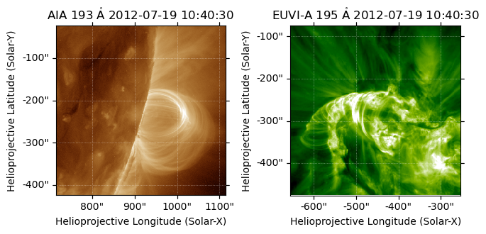

How to fit a CLB loop to your paired sunpy maps
===============================================

This notebook will help you create and / or modify a CLB parameter file.
If you need a pair of cropped AIA / STEREO images for fitting, please
see `eg_aia_stereo_pair.ipynb <eg_aia_stereo_pair.ipynb>`__.

First, we prepare our necessary imports.

.. code:: ipython3

    import sunpy.map
    from CoronalLoopBuilder.builder import CoronalLoopBuilder # type: ignore
    import astropy.units as u
    
    import matplotlib.pyplot as plt

Also, let’s adjust our settings for this run.

- Set **update_with_dummy** to ``True`` if this is the first time you
  are running this script, and there is no loop parameter file matching
  **LOOP_DIR + LOOP_FNAME** that you wish to preserve.
- Change **CROPPED_DIR** to the location of your cropped AIA and STEREO
  maps, and change **AIA_IMG** and **STEREO_IMG** to their filenames.
- **LOOP_DIR** is the default save location for Coronal Loop Builder
  parameters. Change **LOOP_FNAME** for a different parameter file name.

  - *Careful! Choose* **LOOP_FNAME** *so as to not overwrite a previous
    loop file!*

.. code:: ipython3

    update_with_dummy = False
    
    CROPPED_DIR = './observations_cropped/2012_aiaprep/'
    AIA_IMG = '195_AIA_2012-07-19T10:40:30.84.fits'
    STEREO_IMG = '195_STEREO_2012-07-19T10:40:30.835.fits'
    
    LOOP_DIR = './loop_params/'
    LOOP_FNAME = 'aia_stereo_loop_195.pkl'

Let’s load our cropped AIA and STEREO maps from the paths above.

.. code:: ipython3

    aia_map = sunpy.map.Map(CROPPED_DIR + AIA_IMG)
    stereo_map = sunpy.map.Map(CROPPED_DIR + STEREO_IMG)

First, observe your selected and preprocessed maps to ensure the correct
ones were chosen.

.. code:: ipython3

    %matplotlib inline
    
    # Create figure with subplots
    fig = plt.figure()
    subfigs = fig.subfigures(1, 2, wspace=0.07)
    
    ax1 = subfigs[0].add_subplot(projection=aia_map)
    aia_map.plot(axes=ax1)
    
    ax2 = subfigs[1].add_subplot(projection=stereo_map)
    stereo_map.plot(axes=ax2)
    
    plt.show()

.. parsed-literal::

    INFO: Missing metadata for solar radius: assuming the standard radius of the photosphere. [sunpy.map.mapbase]
    INFO: Missing metadata for solar radius: assuming the standard radius of the photosphere. [sunpy.map.mapbase]

At this point, we don’t have a set of loop parameters to work with.
Let’s generate a dummy loop based on the coordinates of the center of
the aia map.

.. code:: ipython3

    frameHGS = sunpy.coordinates.frames.HeliographicStonyhurst()
    cencoord = aia_map.center.transform_to(frameHGS)
    
    dummy_lat = cencoord.lat.value
    dummy_lon = cencoord.lon.value
    
    dummy_params = {
            "majax": 0 * u.Mm,
            "minax": 0 * u.Mm,
            "radius": 30 * u.Mm,
            "height": 10 * u.Mm,
            "phi0": dummy_lon * u.deg,
            "theta0": dummy_lat * u.deg,
            "el": 90.0 * u.deg,
            "az": 0 * u.deg,
            "samples_num": 100
        }
    
    dummy_lat, dummy_lon

.. parsed-literal::

    (-13.234095208196353, 84.00108835897177)

Now, let’s align the Coronal Loop Builder loop to the image pair. Use
the sliders that appear in the interactive window to adjust the location
and size of the CLB loop.

- Adjust the ``HGLT`` (Heliographic Latitude) and ``HGLN`` (Heliographic
  Longitude) sliders to locate the solar coordinates of the centermost
  observable loop of the arcade
- Adjust the ``azimuth`` slider to change the rotation of the loop
  relative to the center vertical, so that the footpoints of the loop
  align with the observable flare ribbon
- Adjust the ``radius`` and ``height`` sliders to match the size and
  position of the more head-on view of the arcade
- Adjust ``elevation`` to change the angle of the loop plane relative to
  the solar surface
- Adjust ``Samples num`` to change the resolution of your loop

.. code:: ipython3

    %matplotlib qt5
    
    # Create figure with subplots
    fig = plt.figure()
    subfigs = fig.subfigures(1, 2, wspace=0.3)
    
    # Plot AIA map in the first subplot
    ax1 = subfigs[0].add_subplot(projection=aia_map)
    aia_map.plot(axes=ax1)
    aia_map.draw_limb(axes=ax1)
    
    # Plot SDO map in the second subplot
    ax2 = subfigs[1].add_subplot(projection=stereo_map)
    stereo_map.plot(axes=ax2)
    aia_map.draw_limb(axes=ax2)
    
    # Adjust layout
    plt.tight_layout()
    
    # Overplot CLB loops
    coronal_loop1 = CoronalLoopBuilder(fig, [ax1, ax2], [aia_map, stereo_map], ellipse=False, **dummy_params, color='r')

.. parsed-literal::

    Loop length: 114.23973285781067 Mm

Save your adjusted CLB loop to a ``.pkl`` file in your local
``loop_params`` folder.

.. code:: ipython3

    if update_with_dummy:
        coronal_loop1.save_params_to_pickle(LOOP_FNAME)

To fine-tune your CLB loop, alternate between executing the following
two cells, first to update the parameters, and second to save your
changes.

.. code:: ipython3

    # Create figure with subplots
    fig = plt.figure()
    subfigs = fig.subfigures(1, 2, wspace=0.3)
    
    # Plot AIA map in the first subplot
    ax1 = subfigs[0].add_subplot(projection=aia_map)
    aia_map.plot(axes=ax1)
    aia_map.draw_limb(axes=ax1)
    
    # Plot SDO map in the second subplot
    ax2 = subfigs[1].add_subplot(projection=stereo_map)
    stereo_map.plot(axes=ax2)
    aia_map.draw_limb(axes=ax2)
    
    # Adjust layout
    plt.tight_layout()
    
    # Overplot CLB loops
    coronal_loop1 = CoronalLoopBuilder(fig, [ax1, ax2], [aia_map, stereo_map], ellipse=False, pkl=LOOP_DIR + LOOP_FNAME, color='r')

.. parsed-literal::

    Loop dimensions loaded:{'radius': <Quantity 40. Mm>, 'height': <Quantity 30. Mm>, 'phi0': <Quantity 94. deg>, 'theta0': <Quantity -14. deg>, 'el': <Quantity 90. deg>, 'az': <Quantity 0. deg>, 'samples_num': 100}
    Loop length: 192.93821549319134 Mm

.. code:: ipython3

    coronal_loop1.save_params_to_pickle(LOOP_FNAME)

.. parsed-literal::

    Loop dimensions saved to './loop_params/aia_stereo_loop_195.pkl'!

Now that you have created a clb loop, you can apply it when `aligning a
synthetic projection <eg_synth_proj.ipynb>`__.
