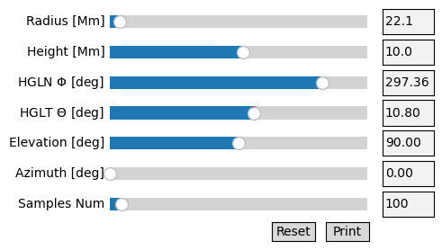
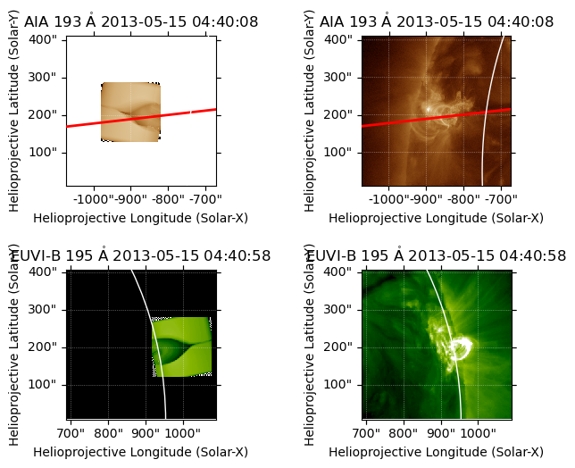
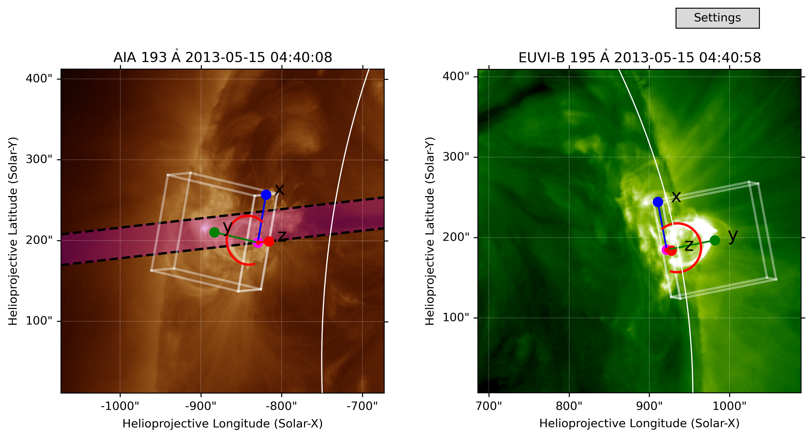
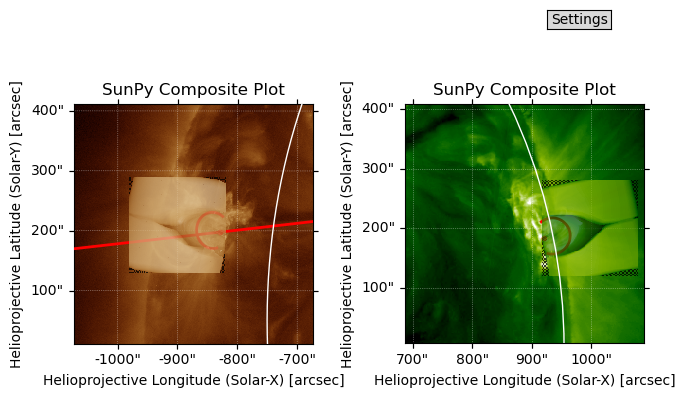

How to create a synthetic sunpy map from projected 3D simulation data
=====================================================================

This notebook will help you create a synthetic map compatible with
Sunpy, oriented by a Coronal Loop Builder parameter file. If you need to
create your first CLB parameter file, please see
`eg_clb_loop.ipynb <eg_clb_loop.ipynb>`__.

Let’s first import our packages.

.. code:: ipython3

    import matplotlib.pyplot as plt
    
    from rushlight.utils.proj_imag_classified import SyntheticFilterImage as sfi
    from rushlight.config import config
    
    from CoronalLoopBuilder.builder import CoronalLoopBuilder # type: ignore
    import sunpy
    
    import aiastereo as aist
    
    from astropy.coordinates import SkyCoord
    import astropy.units as u

Also, let’s define some settings for the run. - **CROPPED_DIR** +
**AIA_IMG** / **STEREO_IMG** should be the path to your target AIA and
STEREO maps, respectively - **LOOP_PTH** (**LOOP_DIR** + **LOOP_FNAME**)
should point to the pickled CLB parameter file (type dict) that defines
the orientation of your projection

.. code:: ipython3

    CROPPED_DIR = './observations_cropped/'
    AIA_IMG = '195_AIA_2013-05-15T04:40:08.80.fits'
    STEREO_IMG = '195_STEREO_2013-05-15T04:40:58.913.fits'
    
    LOOP_DIR = './loop_params/'
    LOOP_FNAME = 'aia_stereo_loop_195.pkl'
    LOOP_PTH = LOOP_DIR + LOOP_FNAME

Let’s load our aia and sdo maps from the **CROPPED_DIR** and \***_IMG*\*
paths defined above.

.. code:: ipython3

    aia_map = sunpy.map.Map(CROPPED_DIR + AIA_IMG)
    stereo_map = sunpy.map.Map(CROPPED_DIR + STEREO_IMG)

Now, let’s define some parameters for the projection to handle. -
**datacube** should refer to the path of the simulation data you would
like to project. - This can either be retrieved from
**config.SIMULATIONS[‘DATASET’]** (after calling **rushlight.config**),
or you can explicity define ``'your/path/as/a/string'``. - **zoom** is a
numerical value between 0 and 1, with larger values creating a larger
projection within the viewing window.

.. code:: ipython3

    # Remaining variables for sfi generation 
    datacube = config.SIMULATIONS['DATASET']    # Path to 3D gaseous dataset to be projected
    zoom = 0.4                                  # Zoom amount for projected box (0-1)

Here, we create a matplotlib figure with 4 panels: 2 observation-based
sunpy maps, and 2 model-based sunpy maps.

We also overplot the previously generated coronal loop over each map for
comparison. Adjust your zoom level to match the projection’s apparent
size to that of the coronal loop.

.. code:: ipython3

    # Create figure with subplots
    fig = plt.figure()
    subfigs = fig.subfigures(2, 2, wspace=0.07)
    
    # Generate aia-based SFI and plot synthetic, real maps
    sfiObj1 = sfi(dataset=datacube, smap=aia_map, pkl=LOOP_PTH, zoom=zoom)   #TODO add in manual norm / north to call
    ax1, synthmap1, norm1, north1, image_shift1 = sfiObj1.synthmap_plot(fig=subfigs[0,0], plot='synth')
    ax2 = subfigs[0,1].add_subplot(projection=aia_map)
    aia_map.plot(axes=ax2)
    stereo_map.draw_limb(axes=ax1)
    stereo_map.draw_limb(axes=ax2)
    
    # Easier to access CLB parameter in dictionary form
    loop_params = sfiObj1.dims
    
    # Generate stereo-based SFI and plot synthetic, real maps
    sfiObj2 = sfi(dataset=datacube, smap=stereo_map, pkl=LOOP_PTH, zoom=zoom)
    ax3, synthmap2, norm2, north2, image_shift2 = sfiObj2.synthmap_plot(fig=subfigs[1,0], plot='synth')
    ax4 = subfigs[1,1].add_subplot(projection=stereo_map)
    stereo_map.plot(axes=ax4)
    stereo_map.draw_limb(axes=ax3)
    stereo_map.draw_limb(axes=ax4)
    
    # Overplot CLB loops
    coronal_loop1 = CoronalLoopBuilder(fig, [ax1, ax2, ax3, ax4], [synthmap1, aia_map, synthmap2, stereo_map], **loop_params)

.. parsed-literal::

    Loop length: 89.90717749124303 Mm

.. parsed-literal::

    2025-04-25 11:14:28 - sunpy - INFO: Missing metadata for solar radius: assuming the standard radius of the photosphere.
    2025-04-25 11:14:28 - sunpy - INFO: Missing metadata for solar radius: assuming the standard radius of the photosphere.
    2025-04-25 11:14:28 - sunpy - INFO: Missing metadata for solar radius: assuming the standard radius of the photosphere.
    2025-04-25 11:14:28 - sunpy - INFO: Missing metadata for solar radius: assuming the standard radius of the photosphere.

.. parsed-literal::

    INFO: Missing metadata for solar radius: assuming the standard radius of the photosphere. [sunpy.map.mapbase]
    INFO: Missing metadata for solar radius: assuming the standard radius of the photosphere. [sunpy.map.mapbase]
    INFO: Missing metadata for solar radius: assuming the standard radius of the photosphere. [sunpy.map.mapbase]
    Loop length: 89.90717749124303 Mm
    INFO: Missing metadata for solar radius: assuming the standard radius of the photosphere. [sunpy.map.mapbase]

.. parsed-literal::

    2025-04-25 11:14:29 - sunpy - INFO: Missing metadata for solar radius: assuming the standard radius of the photosphere.
    2025-04-25 11:14:29 - sunpy - INFO: Missing metadata for solar radius: assuming the standard radius of the photosphere.

.. parsed-literal::

    INFO: Missing metadata for solar radius: assuming the standard radius of the photosphere. [sunpy.map.mapbase]
    INFO: Missing metadata for solar radius: assuming the standard radius of the photosphere. [sunpy.map.mapbase]
    Loop length: 89.90717749124303 Mm

We can also plot a projected LOS from the aia view on the stereo view,
to evaluate the synthetic projection alignment.

.. code:: ipython3

    # Create figure with subplots
    fig = plt.figure()
    subfigs = fig.subfigures(2, 2, wspace=0.07)
    
    # Generate aia-based SFI and plot synthetic, real maps
    sfiObj1 = sfi(dataset=datacube, smap=aia_map, pkl=LOOP_PTH, zoom=zoom)
    ax1, synthmap1, norm1, north1, image_shift1 = sfiObj1.synthmap_plot(fig=subfigs[0,0], plot='synth')
    ax2 = subfigs[0,1].add_subplot(projection=aia_map)
    aia_map.plot(axes=ax2)
    stereo_map.draw_limb(axes=ax1)
    stereo_map.draw_limb(axes=ax2)
    
    # Easier to access CLB parameter in dictionary form
    loop_params = sfiObj1.dims
    
    # Plot los from STEREO onto both AIA maps
    aist.plot_los(ax1, stereo_map, aia_map, loop_params=loop_params, linestyle='-', color='r', lineweight='2')
    aist.plot_los(ax2, stereo_map, aia_map, loop_params=loop_params, linestyle='-', color='r', lineweight='2')
    
    # Generate stereo-based SFI and plot synthetic, real maps
    sfiObj2 = sfi(dataset=datacube, smap=stereo_map, pkl=LOOP_PTH, zoom=zoom)
    ax3, synthmap2, norm2, north2, image_shift2 = sfiObj2.synthmap_plot(fig=subfigs[1,0], plot='synth')
    ax4 = subfigs[1,1].add_subplot(projection=stereo_map)
    stereo_map.plot(axes=ax4)
    stereo_map.draw_limb(axes=ax3)
    stereo_map.draw_limb(axes=ax4)

.. parsed-literal::

    Loop length: 89.90717749124303 Mm

.. parsed-literal::

    2025-04-25 11:14:32 - sunpy - INFO: Missing metadata for solar radius: assuming the standard radius of the photosphere.
    2025-04-25 11:14:32 - sunpy - INFO: Missing metadata for solar radius: assuming the standard radius of the photosphere.

.. parsed-literal::

    INFO: Missing metadata for solar radius: assuming the standard radius of the photosphere. [sunpy.map.mapbase]
    INFO: Missing metadata for solar radius: assuming the standard radius of the photosphere. [sunpy.map.mapbase]
    Loop length: 89.90717749124303 Mm

.. parsed-literal::

    2025-04-25 11:14:33 - sunpy - INFO: Missing metadata for solar radius: assuming the standard radius of the photosphere.
    2025-04-25 11:14:33 - sunpy - INFO: Missing metadata for solar radius: assuming the standard radius of the photosphere.

.. parsed-literal::

    INFO: Missing metadata for solar radius: assuming the standard radius of the photosphere. [sunpy.map.mapbase]
    INFO: Missing metadata for solar radius: assuming the standard radius of the photosphere. [sunpy.map.mapbase]

.. parsed-literal::

    (<matplotlib.patches.Circle at 0x7f63da9576a0>, None)

Additionally, you can plot the edges of the synthetic simulation box
that you are using, along with a visual representation of the slicing
plane used for y-point analysis.

.. code:: ipython3

    # Create figure with subplots
    fig = plt.figure(figsize=(10,6), dpi=300)
    subfigs = fig.subfigures(1, 2)
    
    # Plot AIA map in the first subplot
    ax1 = subfigs[0].add_subplot(projection=aia_map)
    aia_map.plot(axes=ax1)
    stereo_map.draw_limb(axes=ax1)
    
    # Plot the slit plane on the aia map
    los_b = aist.plot_los(ax1, stereo_map, aia_map, loop_params=loop_params, target='bottom', color='k', linestyle='--')
    los_t = aist.plot_los(ax1, stereo_map, aia_map, loop_params=loop_params, target='top', sfiObj=sfiObj1, color='k', linestyle='--')
    aist.color_slice(ax1, aia_map, los_b, los_t, color='m', alpha=0.3)
    
    # Plot synthbox edges on aia map
    aist.plot_edges(ax1, aia_map, sfiObj1, zoom=zoom, axes=True, xoffset=16, fontsize=16)
    
    # Plot SDO map in the second subplot
    ax2 = subfigs[1].add_subplot(projection=stereo_map)
    stereo_map.plot(axes=ax2)
    stereo_map.draw_limb(axes=ax2)
    
    # Plot synthbox edges on stereo map
    aist.plot_edges(ax2, stereo_map, sfiObj2, zoom=zoom, axes=True)
    
    # Overplot CLB loops
    coronal_loop1 = CoronalLoopBuilder(fig, [ax1, ax2], [aia_map, stereo_map], ellipse=False, **loop_params, color='r')

.. parsed-literal::

    2025-04-25 11:14:34 - sunpy - INFO: Missing metadata for solar radius: assuming the standard radius of the photosphere.

.. parsed-literal::

    INFO: Missing metadata for solar radius: assuming the standard radius of the photosphere. [sunpy.map.mapbase]

.. parsed-literal::

    2025-04-25 11:14:35 - sunpy - INFO: Missing metadata for solar radius: assuming the standard radius of the photosphere.

.. parsed-literal::

    INFO: Missing metadata for solar radius: assuming the standard radius of the photosphere. [sunpy.map.mapbase]
    Loop length: 89.90717749124303 Mm

.. image:: eg_synth_proj_files/eg_synth_proj_14_5.png

Lastly, you can plot composite model-observation plots from the sfi
object.

.. code:: ipython3

    # Create figure with subplots
    fig = plt.figure()
    subfigs = fig.subfigures(1, 2, wspace=0.07)
    
    # Generate aia-based SFI and plot composite real-synth map
    ax1, synthmap1, norm, north, image_shift = sfiObj1.synthmap_plot(fig=subfigs[0], plot='comp', alpha = 0.75)
    stereo_map.draw_limb(axes=ax1)
    
    # Plot los from STEREO on the AIA map
    aist.plot_los(ax1, stereo_map, aia_map, loop_params=loop_params)
    
    # Generate stereo-based SFI and plot composite real-synth map
    ax2, synthmap2, norm, north, image_shift = sfiObj2.synthmap_plot(fig=subfigs[1], plot='comp', alpha = 0.75)
    stereo_map.draw_limb(axes=ax2)
    
    # Overplot CLB loops
    coronal_loop1 = CoronalLoopBuilder(fig, [ax1, ax2], [synthmap1, synthmap2], ellipse=False, **loop_params, color='r')

.. parsed-literal::

    2025-04-25 11:14:38 - sunpy - INFO: Missing metadata for solar radius: assuming the standard radius of the photosphere.
    2025-04-25 11:14:38 - sunpy - INFO: Missing metadata for solar radius: assuming the standard radius of the photosphere.

.. parsed-literal::

    INFO: Missing metadata for solar radius: assuming the standard radius of the photosphere. [sunpy.map.mapbase]
    INFO: Missing metadata for solar radius: assuming the standard radius of the photosphere. [sunpy.map.mapbase]
    Loop length: 89.90717749124303 Mm

.. image:: eg_synth_proj_files/eg_synth_proj_16_3.png

